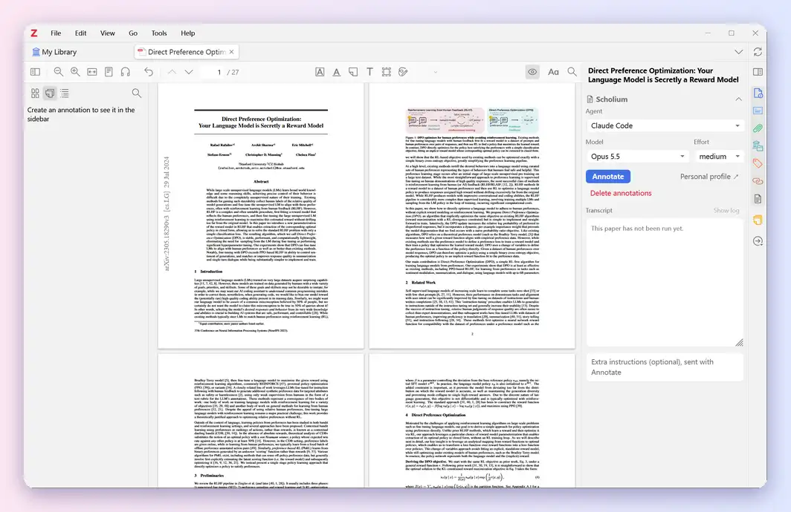
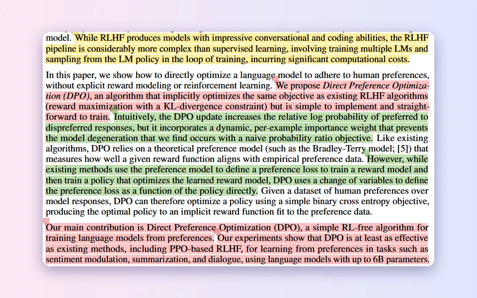
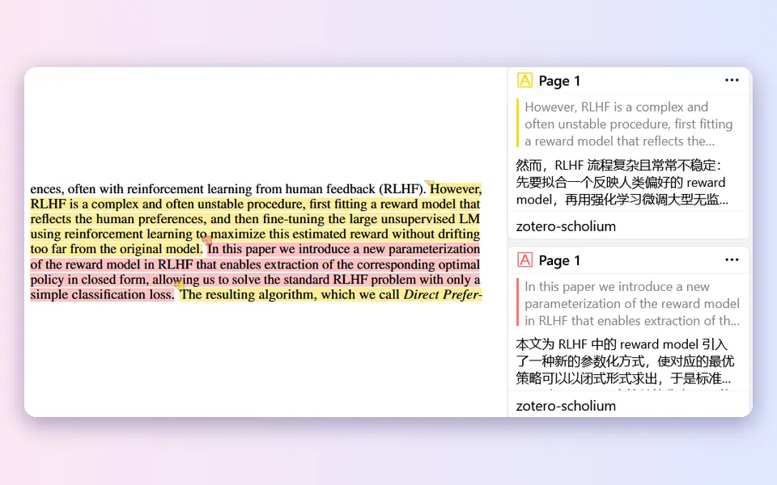
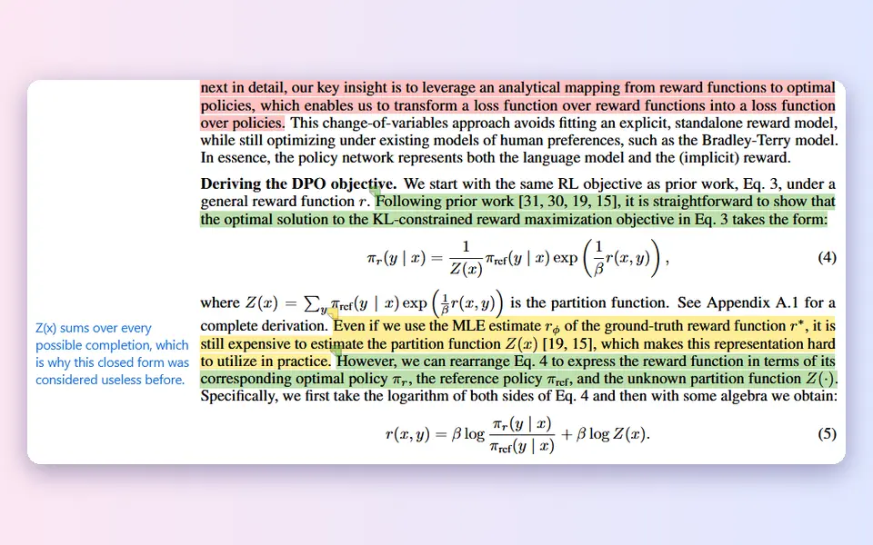
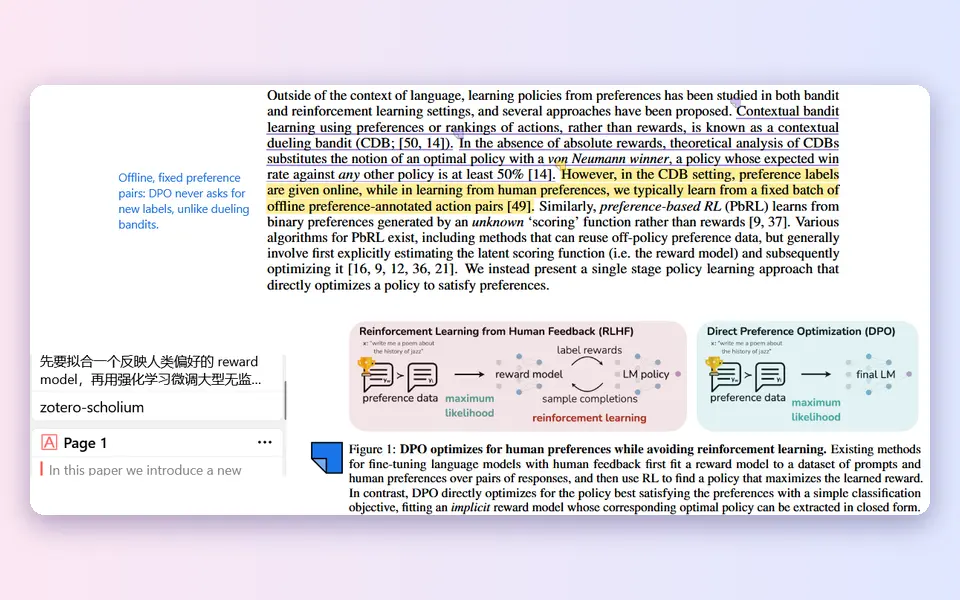
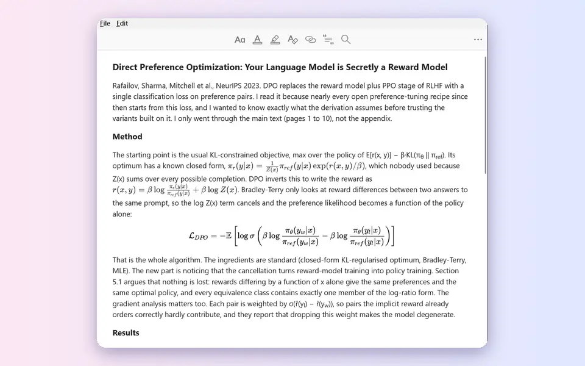
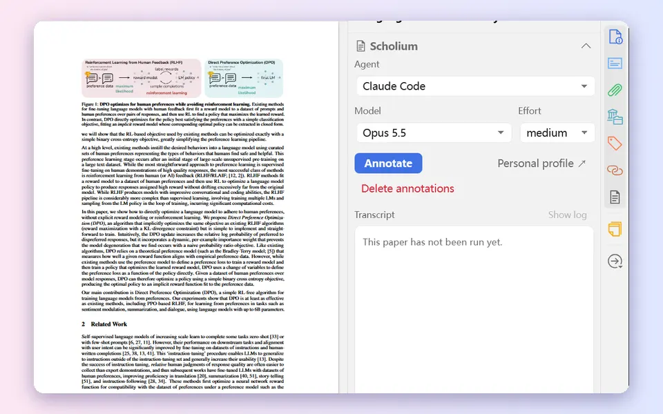
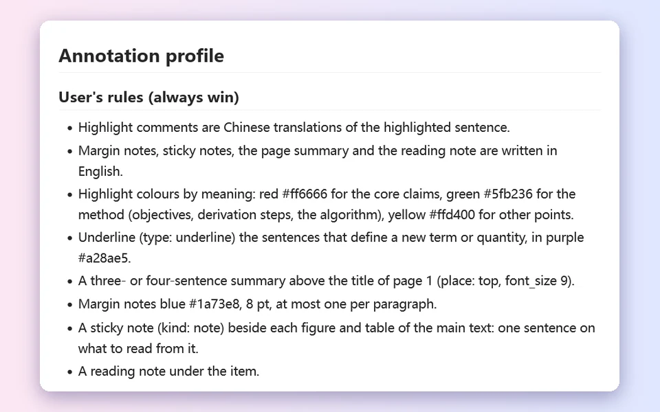
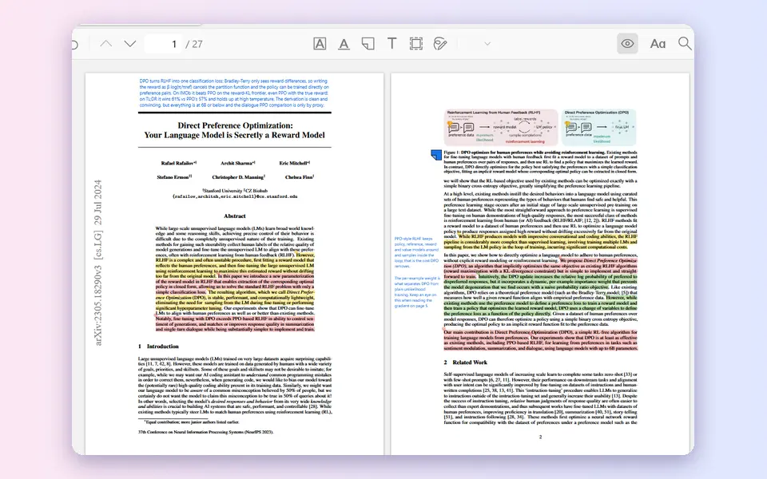
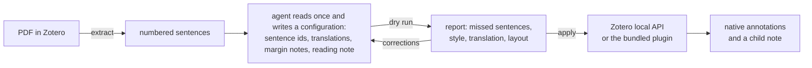

<div align="center">

# zotero-scholium

**Let Claude Code or Codex read a paper and annotate it in Zotero.**

Key sentences highlighted and translated, margin notes beside the paragraphs, a reading note under the item,<br>
all as native Zotero annotations you can edit, search and sync.

[](https://github.com/weilr/zotero-scholium/actions/workflows/ci.yml)
[](https://github.com/weilr/zotero-scholium/releases/latest)
[](https://www.zotero.org/)

English | [中文](README.zh-CN.md)

[Quick start](#quick-start) · [Features](#features) · [How it works](#how-it-works) · [Command line](docs/cli.md) · [Plugin](plugin/README.md) · [Changelog](CHANGELOG.md)

</div>



<sub>One run of Claude Code on <i>Direct Preference Optimization</i> (CC BY 4.0) with the profile shown below, sped up (it took three minutes). All the examples on this page come from that run.</sub>

## Features

<table>
<tr>
<td width="32%"><b>Highlights by meaning</b><br>Red for the claims that carry the paper, green for the method, yellow for the rest. The colours and what they stand for come from your profile.</td>
<td></td>
</tr>
<tr>
<td><b>A translation for every highlight</b><br>Each highlight's comment translates its sentence, and the sidebar shows the two together.</td>
<td></td>
</tr>
<tr>
<td><b>Margin notes</b><br>One or two sentences beside the paragraph: a reaction, a question, a link to another section. They stay clear of the text, the figures and each other.</td>
<td></td>
</tr>
<tr>
<td><b>A summary above the title</b><br>Three or four sentences across the top of page 1.</td>
<td></td>
</tr>
<tr>
<td><b>Underlines and sticky notes</b><br>Definitions underlined, a sticky note at each figure saying what to read from it, when your profile asks for them.</td>
<td></td>
</tr>
<tr>
<td><b>A reading note</b><br>A child note under the item: what the paper does, the numbers that matter, what convinces and what does not, open questions. Equations are rendered.</td>
<td></td>
</tr>
<tr>
<td><b>One click in Zotero</b><br>The Scholium section runs Claude Code or Codex on the selected paper and shows each step. Afterwards, ask for changes in the same conversation, such as <i>shorten the translation on page 5</i>.</td>
<td></td>
</tr>
<tr>
<td><b>Your profile</b><br>How you annotate, learned from the annotations already in your library, plus your own rules. Every run follows it; edit it inside Zotero.</td>
<td></td>
</tr>
<tr>
<td><b>Show or hide</b><br>The eye button in the reader toolbar hides the tool's annotations in every reader and brings them back.</td>
<td></td>
</tr>
</table>

The agent does a dry run before writing: unmatched sentences, translations that add terms or numbers, stock phrases, overlapping highlights and margin notes without room are reported and fixed first. The skill follows the [Agent Skills](https://agentskills.io/) format, so Claude Code, Codex, Cursor and other agents can use it.

## Quick start

You need Zotero 7 or later with its local API turned on (Settings → Advanced → *Allow other applications on this computer to communicate with Zotero*), and Python 3.9+ with PyMuPDF (`pip install pymupdf`).

### One click in Zotero

1. Install [Claude Code](https://claude.com/claude-code) or [Codex](https://github.com/openai/codex) and sign in.
2. Install the skill for it:
   ```bash
   npx skills add weilr/zotero-scholium -g -y
   ```
3. Download [`scholium-bridge.xpi`](https://github.com/weilr/zotero-scholium/releases/latest/download/scholium-bridge.xpi) and install it in Zotero: Tools → Plugins → ⚙ → Install Plugin From File.
4. Select a paper, open the **Scholium** section and press **Annotate**. On Zotero 10, choose *Always Allow* when Zotero asks whether the tool may write.

### From your agent

Install the skill as above and ask in the conversation:

```
Annotate "Direct Preference Optimization" in my Zotero library
Highlight the key claims of "Direct Preference Optimization" with translations and add margin notes
Write a reading note for "Direct Preference Optimization"
```

Close and reopen the PDF afterwards to see the result.

<details>
<summary>Other ways to install the skill, and updating</summary>

**Claude Code plugin**, kept up to date by `/plugin`:

```
/plugin marketplace add weilr/zotero-scholium
/plugin install zotero-scholium@zotero-scholium
```

**Manual:** copy [`skills/zotero-scholium/`](skills/zotero-scholium/) into the agent's skills directory: `~/.claude/skills/` for Claude Code, `~/.codex/skills/` for Codex, `~/.agents/skills/` for other agents. The directory is self-contained.

**Updating:** `npx skills update zotero-scholium`, or `/plugin update zotero-scholium@zotero-scholium`. The plugin updates itself through Zotero's add-on updater.

</details>

## How it works



The agent only picks sentence numbers and writes the text. The tool finds the exact words and their position on the page, places each margin note beside its paragraph where there is room, and writes everything through Zotero 10's local API, or the bundled plugin on Zotero 7–9.

More in [docs/design.md](docs/design.md) (data model, write channels, repeated runs) and [references/configuration.md](skills/zotero-scholium/references/configuration.md) (every option and report field).

## Contributing

Bug reports and pull requests are welcome; see [CONTRIBUTING.md](CONTRIBUTING.md).

## License

[MIT](LICENSE)

## Acknowledgements

- [Zotero](https://www.zotero.org/), whose local API made a plugin-free write channel possible.
- [PyMuPDF](https://pymupdf.readthedocs.io/), used for text extraction and page geometry.
- The screenshots show *Direct Preference Optimization: Your Language Model is Secretly a Reward Model* by Rafailov et al. (NeurIPS 2023, [arXiv:2305.18290](https://arxiv.org/abs/2305.18290), [CC BY 4.0](https://creativecommons.org/licenses/by/4.0/)).
